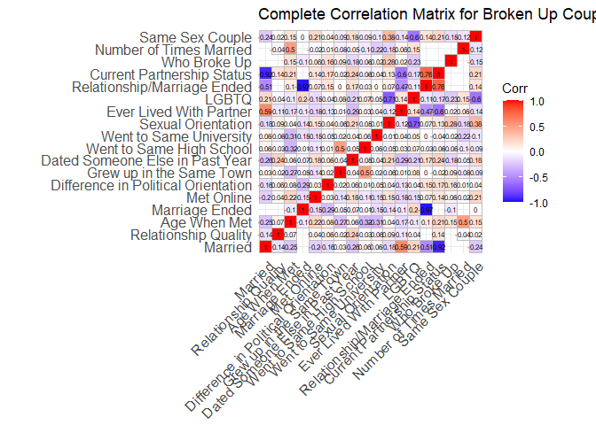
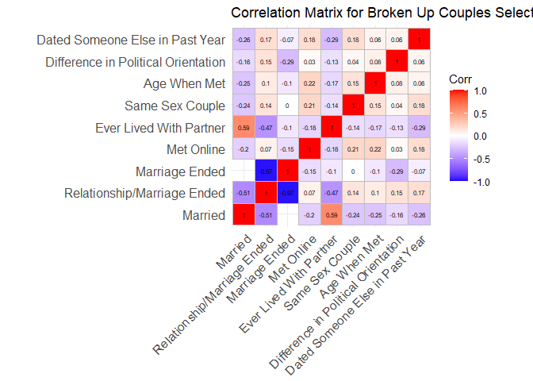

report
================
Nathan Faber and Thomas Jagielski
2020-11-27

  - [How Couples Meet and If They Stay
    Together](#how-couples-meet-and-if-they-stay-together)
      - [Question](#question)
      - [Dataset and Background](#dataset-and-background)
      - [EDA](#eda)
      - [Loading and Processing Data](#loading-and-processing-data)
      - [Correlation Matrix for Predictive
        Factors](#correlation-matrix-for-predictive-factors)
      - [Modeling](#modeling)
      - [Results](#results)
      - [Remaining Questions / Where to
        next?](#remaining-questions-where-to-next)

## How Couples Meet and If They Stay Together

### Question

Are there predicting factors for if a couple are more likely to stay
together or split up? If so, can we model the likelihood of a couple
staying together or splitting up based on inputs for the predicting
factors?

### Dataset and Background

This project utilizes the HCMST (How Couples Meet and Stay Together)
\[<https://data.stanford.edu/hcmst2017>\] This dataset was collected in
2017 and is made up of \~4,000 survey results from individuals 18+ that
had been in a relationship previously. This survey is a remake of an
earlier version of this survey with similar data. The data contains a
wide range of variables–all pertaining to the individual and their
partner. Some examples of the data available include: Race, Religion,
Level of Education, Sexual Orientation, How their relationship ended
etc.

The survey does have several notable quirks. The survey separates out an
LGB group that was specifically sampled for. The survey was orchestrated
through a rewards platform (KnowledgeBase) in which participants were
compensated. This could introduce some form of sample bias. There were
specific measures taken to attempt to get a representative sample, for
example, random dialing of telephone numbers, as well as using address
based sampling.

Given the above, this data source suits our purposes and will aid us in
understanding which factors cause couples to stay together.

### EDA

As you have probably realized from above, this dataset is really quite
large (3,500 rows by 285 columns)\! One of the first things that we
noticed was the enormous number of NA values in each column. Upon
further investigation these NA’s are intentional and indicate that the
subject was not asked that question. Luckily we have access to the
survey data (see the data folder of our repo) where we can see what each
of the questions were and what constraints were needed for that question
to be asked.

Put simply, there were more data and more question branches than we
could deal with in our limited amount of time. We decided to focus on
the questions on the married vs unmarried branches since that was in
line with our end goal. Luckily, we found that for both the married and
unmarried participants they were asked more or less the same question.
For example, married couples would be asked if they met online, whereas
couples that weren’t married would be asked an identical question. Due
to the survey collection method the data was stored in different
columns. To deal with this problem we used the tidyverse `coalesce`
function to merge the two columns and get rid of NA values.

There were a myriad of other problems regarding the coding of the data.
Some examples included: - the dataset was almost entirely categorical
variables - data was in a STADA format which is proprietary - naming
conventions of columns required lots of manual lookups - each question
could also be “refused” - factors had order but were not consistent
across the dataset

### Loading and Processing Data

``` r
# Lets merge the columns for people who got divorced and those who didn't
df_of_interest <- df_filtered %>% 
  mutate(gender_sexually_attracted_to = coalesce(gender_sexually_attracted_to_1, gender_sexually_attracted_to_2, gender_sexually_attracted_to_1_2, gender_sexually_attracted_to_2_2)) %>% 
  mutate(mutual_friends_prior_1 = coalesce(mutual_friends_prior_1, mutual_friends_prior_1_2)) %>%
  mutate(mutual_friends_prior_2 = coalesce(mutual_friends_prior_2, mutual_friends_prior_2_2)) %>%
  mutate(mutual_friends_prior_3 = coalesce(mutual_friends_prior_3, mutual_friends_prior_3_2)) %>%
  mutate(mutual_friends_prior_4 = coalesce(mutual_friends_prior_4, mutual_friends_prior_4_2)) %>%
  
  mutate(partner_education_level = coalesce(partner_education_level, partner_education_level_2)) %>%
  # mutate(times_married = coalesce(times_married_inclusive, times_married_2)) %>%
  mutate(ever_lived_together_w_partner = coalesce(ever_lived_together_w_partner, ever_lived_together_w_partner_2, currently_living_with_partner)) %>% 
  mutate(same_high_school = coalesce(same_high_school, same_high_school_2)) %>% 
  mutate(same_university = coalesce(same_university, same_university_2)) %>% 
  mutate(met_online = coalesce(met_online, met_online_2)) %>% 
  mutate(sexual_orientation = coalesce(sexual_orientation, sexual_orientation_2)) %>% 
  mutate(partner_polictial_belief = coalesce(partner_polictial_belief, partner_polictial_belief_2)) %>% 
  mutate(sexual_orientation = coalesce(sexual_orientation, sexual_orientation_2)) %>% 
  
  mutate(grow_up_same_town = coalesce(grow_up_same_town, grow_up_same_town_2)) %>%
  mutate(other_date = coalesce(other_date, other_date_2)) %>% 

  select(married, has_married, ended,
       ever_had_partner,
       relationship_end_nonmar,
       marriage_end_mar,
       ever_lived_together_w_partner,
       age_when_met,
       partnership_status,
       other_date,
       grow_up_same_town,
       partner_polictial_belief,
       sexual_orientation,
       met_online,
       same_high_school,
       same_university,
       who_broke_up,
       times_married,
       partner_education_level, 
       xlgb ,
       w6_same_sex_couple,
       gender_sexually_attracted_to,
       mutual_friends_prior_1,
       mutual_friends_prior_2,
       mutual_friends_prior_3,
       mutual_friends_prior_4,
       relationship_quality,
       partyid7,
       CaseID
  )

df_of_interest
```

    ## # A tibble: 3,320 x 29
    ##    married has_married ended ever_had_partner relationship_en~ marriage_end_mar
    ##    <lgl>   <lgl>       <lgl> <lgl>            <fct>            <fct>           
    ##  1 FALSE   TRUE        TRUE  TRUE             We broke up      <NA>            
    ##  2 TRUE    TRUE        FALSE NA               <NA>             <NA>            
    ##  3 TRUE    TRUE        FALSE NA               <NA>             <NA>            
    ##  4 FALSE   FALSE       TRUE  TRUE             We broke up      <NA>            
    ##  5 TRUE    TRUE        FALSE NA               <NA>             <NA>            
    ##  6 TRUE    TRUE        FALSE NA               <NA>             <NA>            
    ##  7 TRUE    TRUE        FALSE NA               <NA>             <NA>            
    ##  8 TRUE    TRUE        FALSE NA               <NA>             <NA>            
    ##  9 FALSE   FALSE       FALSE TRUE             [Partner Name] ~ <NA>            
    ## 10 TRUE    TRUE        FALSE NA               <NA>             <NA>            
    ## # ... with 3,310 more rows, and 23 more variables:
    ## #   ever_lived_together_w_partner <fct>, age_when_met <fct>,
    ## #   partnership_status <fct>, other_date <lgl>, grow_up_same_town <fct>,
    ## #   partner_polictial_belief <fct>, sexual_orientation <fct>, met_online <fct>,
    ## #   same_high_school <lgl>, same_university <lgl>, who_broke_up <fct>,
    ## #   times_married <fct>, partner_education_level <fct>, xlgb <fct>,
    ## #   w6_same_sex_couple <fct>, gender_sexually_attracted_to <fct>,
    ## #   mutual_friends_prior_1 <fct>, mutual_friends_prior_2 <fct>,
    ## #   mutual_friends_prior_3 <fct>, mutual_friends_prior_4 <fct>,
    ## #   relationship_quality <fct>, partyid7 <fct>, CaseID <fct>

### Correlation Matrix for Predictive Factors

In order to find if there were predictive factors for if someone was
still in a relationship, we considered a correlation matrix for a
variety of the factors. By doing this, we could determine relationships
between variables. We considered the factors that had larger
correlations with one being married, divorced, or separated.
Furthermore, by considering the correlation matrix we were able to
simplify the model by considering one factor that was highly correlated
with another.

``` r
data <-
  df_of_interest %>%
    mutate(across(everything(), as_factor)) %>%
    # Default is 0 is false and 1 is true
    mutate(married = as.numeric(married) - 1,
           relationship_quality = as.numeric(relationship_quality),
           age_when_met = as.numeric(age_when_met),
           marriage_end_mar = as.numeric(marriage_end_mar),
           met_online = as.numeric(met_online),
           met_online = convert_met_online(met_online), # 0 = no; 1 = yes
           partner_polictial_belief = as.numeric(partner_polictial_belief),
           partyid7 = as.numeric(partyid7),
           political_diff = abs(partner_polictial_belief - partyid7),
           grow_up_same_town = as.numeric(grow_up_same_town), 
           grow_up_same_town = convert_same_town(grow_up_same_town), # 0 = no; 1 = yes 
           ever_had_partner = as.numeric(ever_had_partner),
           other_date = as.numeric(other_date) - 1, # 0 = no; 1 = yes
           same_high_school = as.numeric(same_high_school) - 1,
           same_university = as.numeric(same_university) - 1,
           sexual_orientation = as.numeric(sexual_orientation),
           ever_lived_together_w_partner = as.numeric(ever_lived_together_w_partner),
           ever_lived_together_w_partner = convert_ever_lived_with_partner(ever_lived_together_w_partner),
           xlgb = as.numeric(xlgb),
           ended = as.numeric(ended) - 1,
           partnership_status = as.numeric(partnership_status), # 1 = married; 2 = partnered_not_married; 3 = unpartnered, has had past partner
           who_broke_up = as.numeric(who_broke_up) - 1,  #1 = I wanted it more; 2 = partner wanted separation more; 3 = equal
           times_married = as.numeric(times_married) - 2,
           partner_education_level = as.numeric(partner_education_level) - 1, # 0 = LGB sample; 1 = gen pop
           w6_same_sex_couple = as.numeric(w6_same_sex_couple) - 1) # 0 = not same-sex couple; 1 = same-sex couple

complete_list <- 
  c("married", 
    "relationship_quality",
    "age_when_met",
    "marriage_end_mar",
    "met_online",
    "political_diff",
    "grow_up_same_town",
    "ever_had_partner",
    "other_date",
    "same_high_school",
    "same_university",
    "sexual_orientation",
    "ever_lived_together_w_partner",
    "xlgb",
    "ended",
    "partnership_status",
    "who_broke_up",
    "times_married",
    "w6_same_sex_couple")

complete_label <- 
  c("married" = "Married", 
    "relationship_quality" = "Relationship Quality",
    "age_when_met" = "Age When Met",
    "marriage_end_mar" = "Marriage Ended",
    "met_online" = "Met Online",
    "political_diff" = "Difference in Political Orientation",
    "grow_up_same_town" = "Grew up in the Same Town",
    "ever_had_partner" = "Ever had a Partner",
    "other_date" = "Dated Someone Else in Past Year",
    "same_high_school" = "Went to Same High School",
    "same_university" = "Went to Same University",
    "sexual_orientation" = "Sexual Orientation",
    "ever_lived_together_w_partner" = "Ever Lived With Partner",
    "xlgb" = "LGBTQ",
    "ended" = "Relationship/Marriage Ended",
    "partnership_status" = "Current Partnership Status",
    "who_broke_up" = "Who Broke Up",
    "times_married" = "Number of Times Married",
    "w6_same_sex_couple" = "Same Sex Couple")

data[ ,complete_list] %>%
  cor(use="pairwise.complete.obs", method = c("pearson", "kendall", "spearman")) %>%
  round(5) %>%
  ggcorrplot(show.diag = T, type = "full", lab = TRUE, lab_size = 2) +
  ggtitle("Complete Correlation Matrix for Broken Up Couples") + 
  scale_x_discrete(labels=complete_label) +
  scale_y_discrete(labels=complete_label)
```

    ## Warning in cor(., use = "pairwise.complete.obs", method = c("pearson",
    ## "kendall", : the standard deviation is zero

<!-- -->

**Observations**: This correlation matrix is overpopulated with data,
but allows us to observe general trends in correlation throughout the
entire filtered dataset. We can see that many factors have very little
correlation between many of the factors. Oftentimes the strong
correlations are ones that express the same information or have a
logical link. For example, current partnership status has a strong
negative correlation with married. Since higher numbers of partnership
status are divorced or separated and a higher number for marriage
represents the individual being married, this correlation makes sense.

In order to look at specific factors in more detail we will consider a
reduced set below.

``` r
selected_list <- 
  c("married",
    "ended",
    "marriage_end_mar",
    "met_online",
    "ever_lived_together_w_partner",
    "w6_same_sex_couple",
    "age_when_met",
    "political_diff",
    "other_date")

data[ ,selected_list] %>%
  cor(use="pairwise.complete.obs", method = c("pearson", "kendall", "spearman")) %>%
  round(5) %>%
  ggcorrplot(show.diag = T, type = "full", lab = TRUE, lab_size = 2) +
  ggtitle("Correlation Matrix for Broken Up Couples Selected Factors") + 
  scale_x_discrete(labels=complete_label) +
  scale_y_discrete(labels=complete_label)
```

    ## Warning in cor(., use = "pairwise.complete.obs", method = c("pearson",
    ## "kendall", : the standard deviation is zero

<!-- -->

**Observations**: From this correlation matrix we can see that having
ever lived with a partner appears to have one of the strongest
correlations with staying in a marriage. We can also observe that same
sex couples are less likely to married. However, this could be
influenced by political restrictions about same sex marriage in
different regions of the United States. Interestingly a large political
difference has a positive correlation with the ending of a relationship
or marriage; however, if we consider just the ending of a marriage it
appears that there is a negative correlation between political
difference and a marriage ended. Similarly, there appears to be a
negative correlation between political orientation and being married. We
can also observe that there is a positive correlation between someone
having met their partner online and the age when they met. Similarly,
there appears to be a positive correlation between meeting someone
online and being a same sex couple.

### Modeling

Using some of the factors that we found to have a strong correlation in
the previous section, we were interested to see if we could create a
model that would predict if someone would stay married or if their
relationship would end.

``` r
n_train <- data %>%
  summarize(N = as.integer(n()/2)) %>%
  .$N

df_train <-
  data %>%
  slice_sample(n = n_train)
  

df_validate <-
  anti_join(
   data,
   df_train,
   by = "CaseID"
  )
```

Using the training set, we can create a model that predicts the ending
of a relationship.

``` r
model_ended <-
  glm(
    formula = ended ~ met_online + ever_lived_together_w_partner + w6_same_sex_couple + age_when_met + political_diff,
    data = df_train,
    family = "binomial"
  ) 


model_ended %>%
  tidy(
    conf.int = TRUE,
    conf.level = 0.90
  )
```

    ## # A tibble: 6 x 7
    ##   term                  estimate std.error statistic  p.value conf.low conf.high
    ##   <chr>                    <dbl>     <dbl>     <dbl>    <dbl>    <dbl>     <dbl>
    ## 1 (Intercept)           -0.965     0.268       -3.60 3.24e- 4 -1.41      -0.525 
    ## 2 met_online            -0.248     0.234       -1.06 2.91e- 1 -0.640      0.132 
    ## 3 ever_lived_together_~ -1.25      0.0876     -14.3  2.35e-46 -1.40      -1.11  
    ## 4 w6_same_sex_couple     0.612     0.249        2.46 1.38e- 2  0.198      1.02  
    ## 5 age_when_met           0.00885   0.00669      1.32 1.86e- 1 -0.00220    0.0198
    ## 6 political_diff         0.213     0.0577       3.69 2.25e- 4  0.118      0.308

**Observations**: When considering the coefficients for our model we can
see that there appears to be a negative correlation for meeting someone
online and the relationship ending. Similarly, there appears to be a
negative correlation between ever having lived with partner and the
relationship ending. When considering the confidence intervals for these
coefficients, it appears that the ranges do not include zero, which
indicates significance in the model. We can also observe that the
confidence interval for ever having lived with your partner is smaller
than for having met online. The other factors we considered (same sex
couple, age\_when\_met, and political difference) all appear to have
positive correlation with the ending of a relationship. None of the
confidence intervals for these coefficients include 0, which indicates
the significance for all of these factors within our model. The age when
a couple met appears to have the smallest confidence interval out of any
of the factors considered within this model.

We will next validate our model on the validation dataset.

``` r
df_validate_summary <-
  df_validate %>%
  add_predictions(model_ended, var = "log_odds_ratio") %>%
  arrange(log_odds_ratio) %>%
  rowid_to_column(var = "order") %>%
  mutate(pr_ended = inv.logit(log_odds_ratio)) %>%
  mutate(ended_prediction = ifelse(pr_ended >= 0.5, 1, 0)) %>%
  mutate(N = as.integer(n())) %>%
  filter(ended_prediction == ended) %>%
  mutate(N_correct = as.integer(n())) %>%
  summarize(percent_correct = N_correct / N) %>%
  summarize(mean(percent_correct))
  
df_validate_summary
```

    ## # A tibble: 1 x 1
    ##   `mean(percent_correct)`
    ##                     <dbl>
    ## 1                   0.852

**Observations**: We find that using a log-odds threshold of 0.5% as the
cutoff for an ending prediction (less than 0.5 indicates staying
together; whereas, greater than 0.5 indicates splitting up), out model
yielded the correct prediction for a separation approximately 85% of the
time.

Finally, we can input a test case into the model to predict the outcome
of their relationship.

``` r
data_test <- tibble(met_online = 0, 
                    ever_lived_together_w_partner = 1,  
                    w6_same_sex_couple = 0,  
                    age_when_met  = 26,
                    political_diff = 2,  
                    other_date = 0)

df_prediction <-
  data_test %>%
  add_predictions(model_ended, var = "log_odds_ratio") %>%
  arrange(log_odds_ratio) %>%
  rowid_to_column(var = "order") %>%
  mutate(pr_ended = inv.logit(log_odds_ratio)) %>%
  mutate(ended_prediction = ifelse(pr_ended >= 0.5, 1, 0)) # 0 = False; 1 = True

print.data.frame(df_prediction) # use to print the entire dataframe in knitted document 
```

    ##   order met_online ever_lived_together_w_partner w6_same_sex_couple
    ## 1     1          0                             1                  0
    ##   age_when_met political_diff other_date log_odds_ratio pr_ended
    ## 1           26              2          0      -1.561343 0.173454
    ##   ended_prediction
    ## 1                0

``` r
#df_prediction
```

### Results

While this model is far from perfect it does indicate that certain
factors can influence whether people are still together. We do not claim
that this is the best model that could be created from this data. We
were more interested in the process of creating this model than creating
the best one. We could imagine taking into account more factors like age
for better results. One cool thing about this model is that not only do
we have confidence intervals for each of the coefficients calculated, we
output a probability at the end. This allows us to see which factors are
actually important. The final output of a probability is also cool
because it allows us to compare two predictions side by side with some
form of uncertainty. Likely the largest amount of uncertainty in this
dataset is related to how well it fits the population. There were hints
within the documentation of ways that the survey team tried to normalize
this. Unfortunately, the documentation wasn’t clear or detailed enough
for us to use any of the work they had done

### Remaining Questions / Where to next?

This was an eye opening project in several different ways. We ran into
ethical questions of whether we should model relationships/human
behavior as well as technical problems related to the whacky survey
format. We have only scratched the surface of this dataset. There is
tons more exploration that could be done. For example, the dataset has
some normalization values to try and make their sample more
representative of the population – we didn’t factor this into any of our
calculations. We also chose to look at a very small subset of the
columns in a discretized way. One example of this is how we look at
simply the end of marriages as separation or divorce, where the dataset
differentiates. This means that there are likely many more trends
present in this data that we didn’t look at.

Here are a few other things that we were interested in exploring: - How
are the predictors that influence whether relationships end changed with
age? - Can attributes about a relationship be accurately predicted based
on other data (aka can we tell which couples met online?) - In what
cases does our prediction model break - Are there significant
differences in predictors for lgbt+ couples vs straight couples - What
are the implications of this work? Do dating apps employ something like
this and is it alright/biased?
